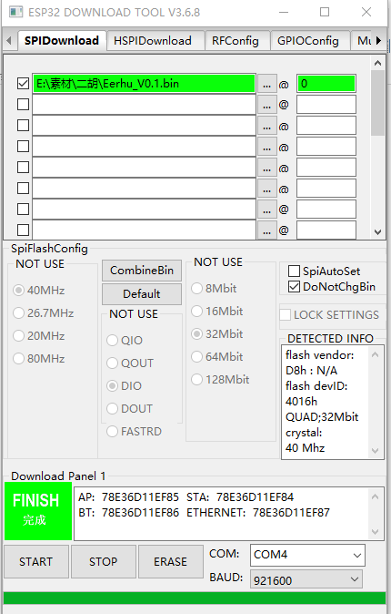
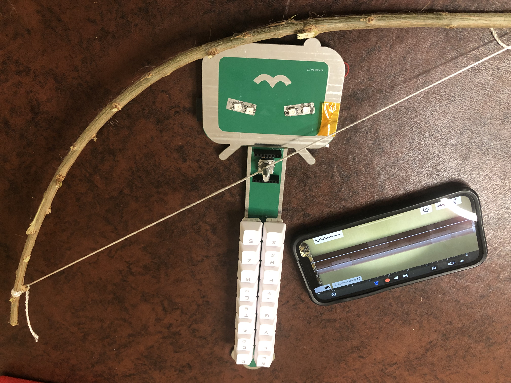

# Electronic Erhu
 

How can a machine replicate the nuances and emotions of human music performance, rather than merely producing standardized sounds devoid of personal touch? Furthermore, how can these machines be designed to harmoniously accompany live human performers? As I embark on this journey, my initial endeavor is to create a machine performer—an electronic string instrument that fuses human touch with control. This foundation will then be enriched with machine intelligence in my subsequent project.

This repository contains files and guidelines pertaining to this project. Feel free to use them as you deem appropriate.

## Project Objectives
### What?
Construct an electronic rendition of the Chinese stringed instrument, Erhu. This version uses a physical bow for input control, outputs in MIDI format, and transmits the data via BLE to a DAW for further editing, mixing, and synthesis.

### Why / Inspirations:
- Using a MIDI keyboard in conjunction with DAW's Virtual Studio Technology (VST) plugins presents certain challenges when generating, editing, and mixing a musical track. Playing an instrument digitally using buttons and knobs feels __starkly different__ and __less intuitive__ than the tactile experience of playing a physical Erhu with a bow. Such interfaces often fail to capture the subtle nuances of pitch, tone color, volume, and note articulation. 
- This project is inspried by an [DIY electornic erhu project](https://oshwhub.com/Dr.Zhang/edrum_copy_copy) which crafts an electronic Erhu with a __physical bow__, merging the __advantages of digital music__ with the __intuitive control of a traditional instrument__, tailored for human performers.
- The incorporation of physical bow control not only serves the musical purpose but also establishes a foundation for __robotic arm control__. This exploration seeks to understand how an autonomous music machine might keenly __observe and glean insights from the nuanced movements and emotions of human performers__, transcending mere technical precision and embracing the human touch in their performance. How might such machines effectively __track and harmonize with human musicians__ in an orchestral setting? The E-Erhu represents the inaugural phase of my journey to craft a sophisticated machine performer—an electronic string instrument adept at producing music imbued with human finesse and sentiment. This foundation will be further augmented with software-driven mechanical nuances in my upcoming project.

## Description: 
This section contains my learning summary.

This project entails crafting an electronic erhu utilizing the ESP32 module, enabling it to establish a Bluetooth connection with the "GarageBand" app on an iPhone to produce music.
The main control module uses ESP32, and its core components are 16 mechanical keyboard keys and an EC11 encoder.

 

Here are the links for additional resources and learning materials:
- [MCP ESP32](https://www.espressif.com/en/products/socs/esp32)
- [Bluetooth LE MIDI Specification](https://www.midi.org/specifications-old/item/bluetooth-le-midi)
- [Free Circuit Board Design & Process](https://lceda.cn/editor) for modifing the PCB design.
- [Espressif IoT Development Framework](https://docs.espressif.com/projects/esp-idf/en/latest/esp32/get-started/#installation) for modifying ESP32 software.
- [ESP32 Download Tool](https://www.espressif.com/en/support/download/other-tools?keys=&field_type_tid%5B%5D=13) for downloading firmware to the target board. 

### Hardware Design & Instructions to Build an E-Erhu: 
[DIY electornic erhu project](https://oshwhub.com/Dr.Zhang/edrum_copy_copy) provides comprehensive information on hardware design and step-by-step instructions for constructing an E-Erhu.
Here are my additional notes:
- Soldering Component 16 can be a bit challenging. You may find it helpful to use a scope to ensure precise soldering.

    
    

- It's worth mentioning that a standard encoder produces a clicking sound and vibrations when rotated. To resolve this matter, the encoder needs to be disassembled using appropriate tools, and its components should be removed one by one. Locate the innermost spring piece and use tweezers to depress these two spring components. Subsequently, reassemble all the components in the correct sequence and seal the encoder. Removing this spring enhances the encoder's rotational smoothness.

### Firmware:
The [Original Software Source Code](https://github.com/ospanic/eerhu) can be found at: https://github.com/ospanic/eerhu. I have also cloned it to the "eerhu" folder. Additionally, Eerhu_V0.1.bin is a precompiled target image that can be downloaded to the target board using the [ESP32 Download Tool](https://www.espressif.com/en/support/download/other-tools?keys=&field_type_tid%5B%5D=13).

### Integration:
To connect your electronic erhu, open the GarageBand app on your mobile phone, then tap on "Settings" -> "Advanced" -> "Bluetooth MIDI Devices." With a little practice, I hope you'll soon find joy in playing.

