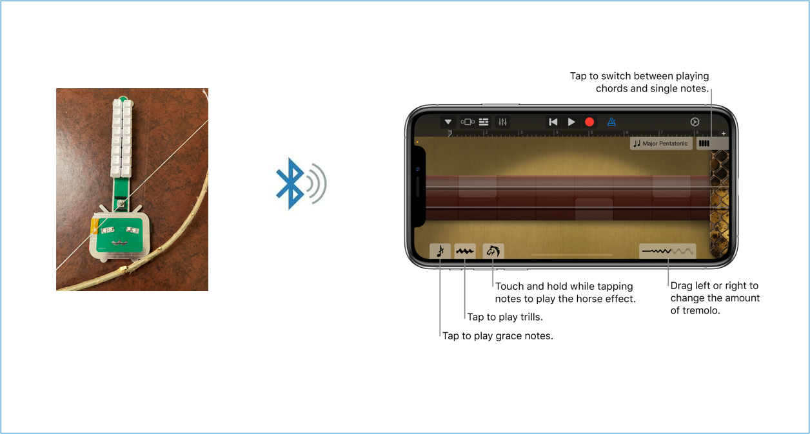

# Electronic Erhu
 

## 1. Project context
How can a machine emulate the nuances and emotions of human performance, instead of yielding uniform sounds that lack a personal touch? Furthermore, what design principles should govern these machines to ensure they accompany human musicians seamlessly and harmoniously on stage? Our exploratory journey of creating a human-machine orchestra begins with a foundational step: crafting an electronic instrument that is programmable so that it is capable of nuanced performance. This instrument will lay the groundwork for future exploration into advanced autonomous control within our forthcoming projects.

This ultimate goal is not just about technical synchronization but capturing the essence of musical empathy, enabling a seamless and emotive interplay between silicon and soul.

This repository contains files and guidelines associated with this project. Please feel free to utilize them.

## 2. Project objective
We've built an electronic version of the Chinese string instrument Erhu which utilizes a __physical bow__ as an input mechanism. This device produces MIDI signals as its output. These signals are then transmitted wirelessly using Bluetooth to a Digital Audio Workstation (DAW) for further editing, mixing, and synthesis.

The physical bow control lays the foundation for robotic arm manipulation, setting the stage for an investigation into how autonomous musical machines can observe and assimilate the nuances of human performers, encompassing both their physical movements and emotional expressions. This venture seeks to transcend mere technical precision, infusing machine performance with a personalized touch.

## 3. Project details 
This section provides a detailed, step-by-step guide to constructing an electronic Erhu, outlining the entire process from start to finish.

This project is inspried by a [DIY e-Erhu project](https://www.bilibili.com/read/cv12730013/). The microprocessor ESP32 utilized in the initial project has reached its end-of-life (EOL), necessitating updates to the circuit design to accommodate a newer version of the processor [ESP32-S](https://docs.ai-thinker.com/en/esp32). Furthermore, the software requires additional refinement to generate MIDI outputs that more precisely capture aspects such as pitch, timbre, dynamics, and the articulation of notes.

### 3.1 Architecture

At a high level, the electronic Erhu detects the analog signals resulting from the physical movements of the bow and the keys. An EC11 encoder subsequently converts these analog signals into digital form. These digital signals are then processed by the ESP32-S microprocessor. Software within this microprocessor is responsible for creating the MIDI sequence and transmitting it to the GarageBand application on an iPhone via Bluetooth. GarageBand ultimately sythesizes the musical output.

 

### 3.2 Circuit design diagrams
The EDA software that we have chosen is an online tool [LC EDA](https://lceda.cn/). It is a free tool that has all the necessary functions for PCB design. In addtion, it is integrated with online marketplace for purchasing PCB and componnents. That's the main reason we decided to choose this one. However, there are other free online tools that are more English friendly, such as 
- [Circuit Diagram](https://www.circuit-diagram.org/)
- [Samrt Draw](https://www.smartdraw.com/circuit-diagram/circuit-diagram-maker.htm)
- [Lucid Chart](https://www.lucidchart.com/pages/examples/circuit-diagram-maker)

You can pick and choose based on your own preferences. We will provide the BOM list and detailed part number for each component. It is totally fine if you choose to use your favorate tool to design and procure the components elsewhere based on the BOM list.

Below is the circuit diagram for the electronic Erhu. 

 

### 3.3 Hardware Design & Instructions to Build an E-Erhu: 

Here are my additional notes:
- Soldering Component 16 can be a bit challenging. You may find it helpful to use a scope to ensure precise soldering.

    
    

- It's worth mentioning that a standard encoder produces a clicking sound and vibrations when rotated. To resolve this matter, the encoder needs to be disassembled using appropriate tools, and its components should be removed one by one. Locate the innermost spring piece and use tweezers to depress these two spring components. Subsequently, reassemble all the components in the correct sequence and seal the encoder. Removing this spring enhances the encoder's rotational smoothness.

### Firmware:
The [Original Software Source Code](https://github.com/ospanic/eerhu) can be found at: https://github.com/ospanic/eerhu. I have also cloned it to the "eerhu" folder. Additionally, Eerhu_V0.1.bin is a precompiled target image that can be downloaded to the target board using the [ESP32 Download Tool](https://www.espressif.com/en/support/download/other-tools?keys=&field_type_tid%5B%5D=13).

### Integration:
To connect your electronic erhu, open the GarageBand app on your mobile phone, then tap on "Settings" -> "Advanced" -> "Bluetooth MIDI Devices." With a little practice, I hope you'll soon find joy in playing.

##Demo

https://github.com/JeffreyLuo333/ElectronicErhu/assets/114297879/c262f2a7-2b90-4fbd-84d1-cd86bc75b108

## Additional resources
Here are the links for additional materials:
- [Knowhow for soldering tiny components](https://www.bilibili.com/video/BV1T94y1D76n/?vd_source=e28f404c31d2a580b2bf5ef9bb423407)
- [Circuit Board Design & Process](https://lceda.cn/editor) for modifying the PCB design.
- [MCP ESP32](https://www.espressif.com/en/products/socs/esp32)
- [Bluetooth LE MIDI Specification](https://www.midi.org/specifications-old/item/bluetooth-le-midi)
- [Espressif IoT Development Framework](https://docs.espressif.com/projects/esp-idf/en/latest/esp32/get-started/#installation) for modifying ESP32 software.
- [ESP32 Download Tool](https://www.espressif.com/en/support/download/other-tools?keys=&field_type_tid%5B%5D=13) for downloading firmware to the target board.

