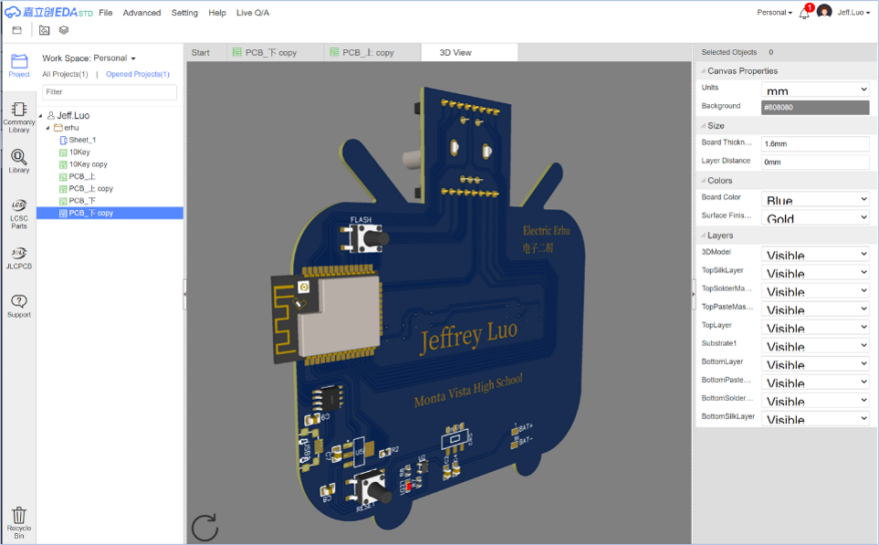
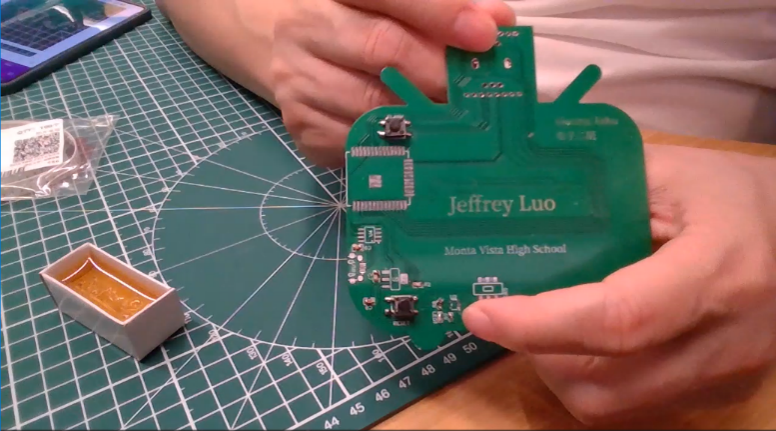
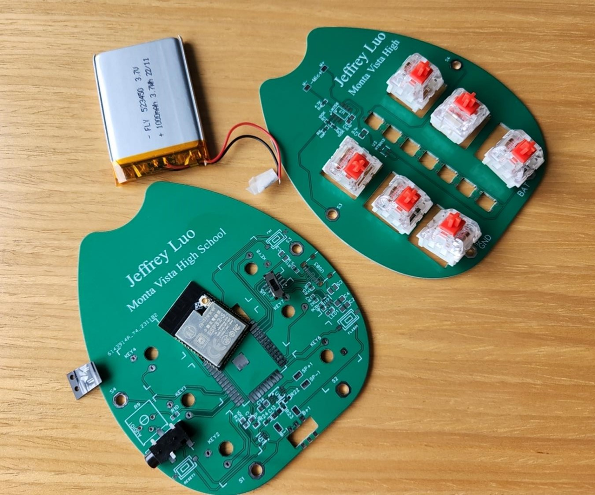

# Programmable Electronic Erhu Instrument
 

Links to all my other __`music technology projects`__ (electronic instruments, AI-powered music signal processing software etc.) are at [http://jeffreyluo.com/#mt](http://jeffreyluo.com/#mt).

## 1. Project context
In a futuristic orchestra, how can autonomous musical machines convey the __`nuances and emotions`__ inherent in human performance, instead of yielding uniform sounds that lack a personal touch? How can such musical machines harmoniously __`accompany human musicians`__ and evoke authentic __`emotional connections`__ with audiences, avoiding perceptions of __`cold technological showmanship`__?

Our exploration into the technologies for a __`human-machine orchestra`__ begins with a foundational step: crafting an electronic instrument that is __`programmable`__ so that it can be further __`trained for nuanced performance`__. This instrument will lay the groundwork for future exploration into advanced autonomous control within our forthcoming projects.

This ultimate goal is not just about technical synchronization but capturing the essence of musical empathy, enabling a seamless and emotive __`interplay between silicon and soul`__.

This repository contains files and guidelines associated with this project. Please feel free to utilize them.

## 2. Project objective
Our goal is to build an electronic version of the Chinese string instrument Erhu which utilizes a __`physical bow`__ as an input mechanism. This device produces MIDI signals as its output. These signals are then transmitted wirelessly using Bluetooth to a Digital Audio Workstation (DAW) for further editing, mixing, and synthesis.

The physical bow control lays the foundation for robotic arm manipulation, setting the stage for an investigation into how autonomous musical machines can __`observe and assimilate`__ the __`nuances of human performers`__, encompassing both their __`physical movements and emotional expressions`__. This venture seeks to transcend mere technical precision, infusing machine performance with __`a personalized touch`__.

## 3. Project details
This section provides a detailed, step-by-step guide to constructing an electronic Erhu, outlining the entire process from start to finish.

This project is inspried by a [DIY e-Erhu](https://www.bilibili.com/read/cv12730013/) project. The microprocessor ESP32 utilized in the initial project has reached its end-of-life (EOL), necessitating updates to the circuit design to accommodate a new version of the processor [ESP32-S](https://docs.ai-thinker.com/en/esp32). Furthermore, the software requires further refinement to produce MIDI outputs that more accurately reflect critical musical elements, including pitch, timbre, dynamics, and note articulation.

### 3.1 Architecture

At a high level, the electronic Erhu captures the analog signals resulting from the physical movements of the bow and the keys. An EC11 encoder subsequently converts these analog signals into digital form. These digital signals are then processed by the ESP32-S microprocessor. Software within this microprocessor is responsible for creating the MIDI sequence and transmitting the sequence to the GarageBand application on an iPhone via Bluetooth. GarageBand ultimately sythesizes the musical output.

  

### 3.2 Circuit design diagrams
The EDA software we've selected, [LC EDA](https://lceda.cn/), is an online platform that offers comprehensive functionality for PCB design at no cost. Additionally, it is integrated with an online marketplace for procuring PCBs and components, which is the primary reason for our decision to opt for this particular tool. 

 

Nevertheless, there are alternative free online tools available that offer greater ease of use for English-speaking users, such as 
- [Circuit Diagram](https://www.circuit-diagram.org/)
- [Smart Draw](https://www.smartdraw.com/circuit-diagram/circuit-diagram-maker.htm)
- [Lucid Chart](https://www.lucidchart.com/pages/examples/circuit-diagram-maker)

You are free to select components according to your personal preferences. We will supply you with a Bill of Materials (BOM) and detailed part numbers for each component below. Should you prefer to utilize your own preferred tools for design and procurement, you are completely at liberty to source the components from alternative vendors, guided by the provided BOM list.

Below is the circuit diagram for the electronic Erhu, modified based on the original diagram with the older version of microprocessor. 

 

Below are PCB schematics for the top and bottom PCBs respectively.

 
 

### 3.3 Bill of Materials (BOM)

 

All the components can be placed on a piece of paper.

 

### 3.3 Soldering process
Soldering is no easy task. It took us weeks to practice and finally become skilled at doing it. Soldering components are prettry much the same. Below, we will just show the images and a video for component 8, the resistors, since they are very tiny.

   

Soldering the microprocessor, component 16, can be somewhat challenging because of its numerous small pins that are closely spaced. Utilizing a __magnifying__ scope may enhance the precision of your soldering work.

  

It is important to note that the standard EC11 encoder generates an audible clicking noise and tactile vibrations upon rotation. To address this issue, the encoder must be carefully disassembled with the correct tools, and its internal components meticulously dismantled in sequence. Identify the central spring element and employ tweezers to gently compress these dual spring parts. Following this adjustment, reassemble the components in their precise order and securely reseal the encoder. Eliminating this spring effectively improves the encoder's rotational fluidity.

### 3.4 Firmware
Based on the [original source code](https://github.com/ospanic/eerhu), we refined specific segments of the codebase to generate MIDI outputs that more accurately reflect critical musical elements, including pitch, timbre, dynamics, and note articulation. You can find the source code under the "eerhu" folder. 

Eerhu_V0.2.bin in the binary folder is a precompiled target image that can be downloaded to the target board using the [ESP32 Download Tool](https://www.espressif.com/en/support/download/other-tools?keys=&field_type_tid%5B%5D=13).

### 3.5 Integration of e-Erhu and syhthesizer
To connect your electronic erhu, open the GarageBand app on your iPhone, then tap on "Settings" -> "Advanced" -> "Bluetooth MIDI Devices." 

With some practice, I am confident that you will quickly discover the joy of playing the electronic Erhu.

## 4. Demo of e-Erhu in action
Here is our trio team:-)

Watch the demo by clicking on the image below.

<!-- https://github.com/JeffreyLuo333/ElectronicErhu/assets/114297879/c262f2a7-2b90-4fbd-84d1-cd86bc75b108 -->

## 5. Sequel - a programmable electronic wind instrument
We are in the process of building an electronic wind instrument generating MIDI digital output, controlled by airflow, as a sequel to this electronic Erhu instrument hardware project.

  
  

 

## 6. Additional resources
Here are the links for additional materials:
- [Knowhow for soldering tiny components](https://www.bilibili.com/video/BV1T94y1D76n/?vd_source=e28f404c31d2a580b2bf5ef9bb423407)
- [Circuit Board Design & Process](https://lceda.cn/editor) for modifying the PCB design.
- [MCU ESP32](https://docs.ai-thinker.com/en/esp32)
- [Bluetooth LE MIDI Specification](https://www.midi.org/specifications-old/item/bluetooth-le-midi)
- [Espressif IoT Development Framework](https://docs.espressif.com/projects/esp-idf/en/latest/esp32/get-started/#installation) for modifying ESP32 software.
- [ESP32 Download Tool](https://www.espressif.com/en/support/download/other-tools?keys=&field_type_tid%5B%5D=13) for downloading firmware to the target board.

Best of luck! Should you run into any issues, please feel free to contact us at jeffrey.luo333@gmail.com

Links to all my other __`music technology projects`__ (electronic instruments, AI-powered music signal processing software etc.) are at [http://jeffreyluo.com/#mt](http://jeffreyluo.com/#mt).

